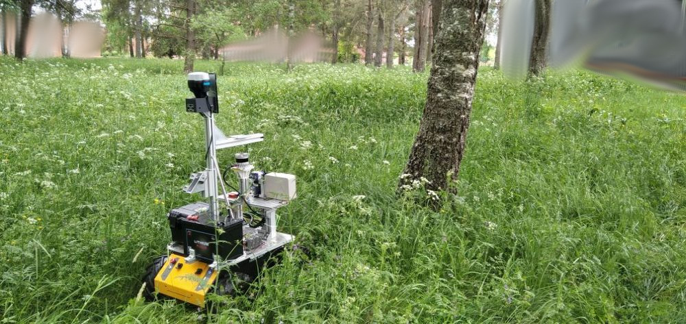
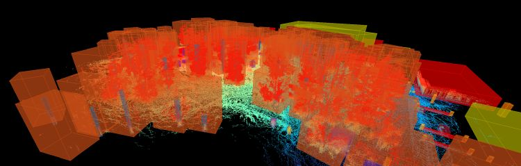
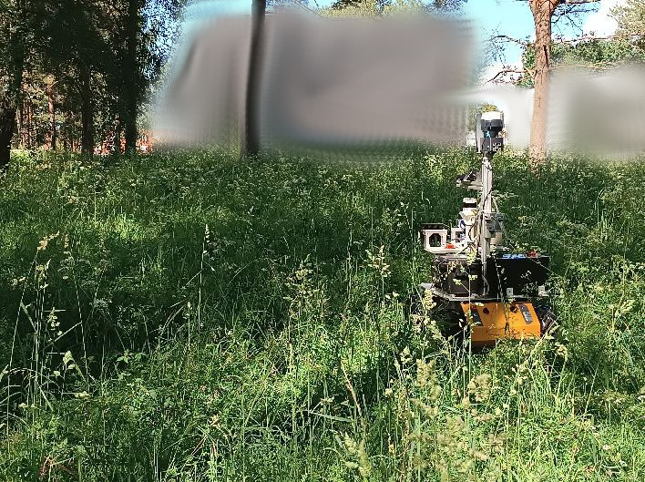
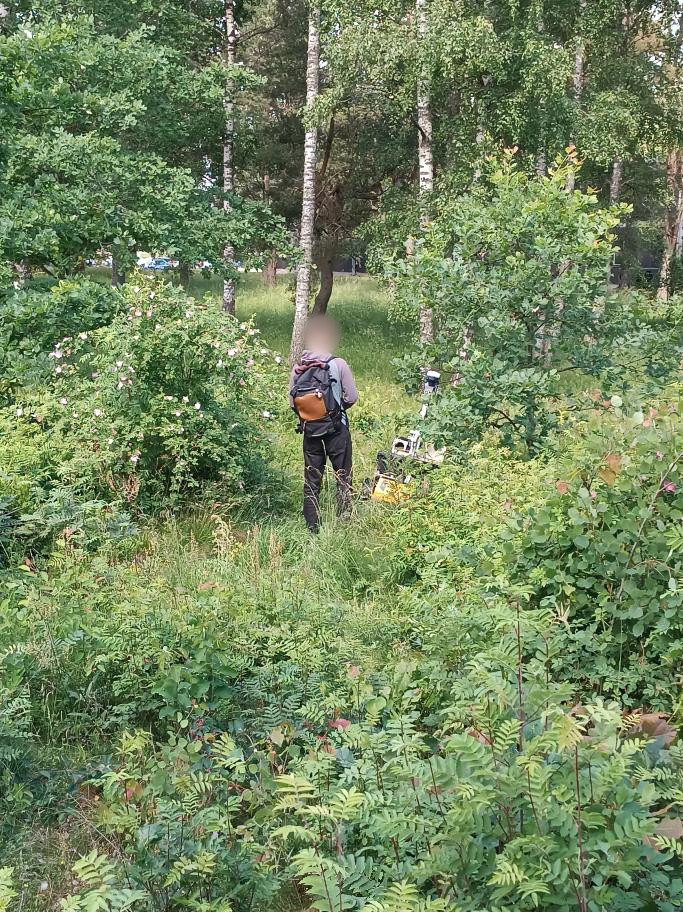

### 📚 Table of Contents

* [Dataset Description](#dataset-description)
* [Dataset Parts](#dataset-parts)
* [Data Structure and File Organization](#data-structure-and-file-organization)
* [Downloads](#downloads)
* [Examples and Teasers](#examples-and-teasers)
* [Acknowledgement](#acknowledgement)

# The Radar Forest Dataset [working title]

## Dataset description

*The recorded dataset captures a forested area that contains fully grown and young trees, dense undergrowth, bumpy terrain and occasional rocks.*



*Using the [Segments.ai](https://segments.ai) online 3D labeling solution, the reference point cloud maps from two recording runs were manually labeled, allowing lidar, radar and potentially also camera online labeling when re-playing the data in ROS.*

TODO:
The dataset includes LiDAR, 4D Radar, GNSS, RGB camera and IMU.

---

## Dataset Components
### TODO

* **TODO** (XXs)
 xx

---

## Data Structure and File Organization

```
├── ros1_noetic
│   ├── calibration
│   │   ├── extrinsics
│   │   │   ├── extrinsics.txt
│   │   │   └── frames.pdf
│   │   └── intrinsics
│   │       ├── camera_calibration.txt
│   │       └── hugin_radar_startup_params.txt
│   └── data
│       ├── 2024_05_short_grass_run
│       │   ├── bags
│       │   │   ├── short_grass__ros1__00.bag
│       │   │   ├── ...
│       │   │   └── short_grass__ros1__45.bag
│       │   ├── gps
│       │   │   ├── filtered_RTK_solution.pos
│       │   │   ├── full_RTK_solution.pos
│       │   │   ├── ReachBaseSt_20240501125754
│       │   │   ├── ReachRoverO_20240501133817
│       │   │   └── readme.txt
│       │   └── reference_point_cloud_map
│       │       ├── short_grass_map.pcd
│       │       ├── short_grass_map_subsampled.pcd
│       │       └── short_grass_map_with_normals.vtk
│       └── 2024_06_tall_grass_run
│           ├── bags
│           │   ├── tall_grass__ros1__00.bag
│           │   ├── ...
│           │   └── tall_grass__ros1__44.bag
│           ├── gps
│           │   ├── filered_RTK_solution.pos
│           │   ├── full_RTK_solution.pos
│           │   ├── ReachBaseSt_20240612080138
│           │   ├── ReachRoverO_20240612080516
│           │   └── readme.txt
│           └── reference_point_cloud_map
│               ├── readme.txt
│               ├── tall_grass_map.pcd
│               ├── tall_grass_map_subsampled.pcd
│               └── tall_grass_map_with_normals.vtk
└── ros2_jazzy
    ├── calibration                                                # Same contents as in ROS1
    ├── cuboid_labels
    │   └── short_and_tall_grass_labels.json
    └── data
        ├── 2024_05_short_grass_run
        │   ├── bag
        │   │   └── short_grass__ros2
        │   │       ├── metadata.yaml
        │   │       ├── short_grass__ros2_0.mcap
        │   │       ├── ...
        │   │       └── short_grass__ros2_48.mcap
        │   ├── gps                                                # Same contents as in ROS1
        │   └── reference_point_cloud_map                          # Same contents as in ROS1
        └── 2024_06_tall_grass_run
            ├── bag
            │   └── tall_grass__ros2
            │       ├── metadata.yaml
            │       ├── tall_grass__ros2_0.mcap
            │       ├── ...
            │       └── tall_grass__ros2_49.mcap
            ├── gps                                                # Same contents as in ROS1
            └── reference_point_cloud_map                          # Same contents as in ROS1
```

* `xxx` → Raw sensory data and static transforms.
* `calibration/extrinsics/` → Transformations between sensor frames.
* `calibration/instrinsics/` → Intrinsic parameters for the camera and radar settings.

### Sensors
The dataset provides sensor measurements from these sensors:

* Sensrad Hugin A3-Sample (solid-state 4D radar)
  * Please note that the Hugin A3-Sample radar used in our dataset is an early demo model not with the same performance as the forthcoming production-ready model.
* Ouster OS0-32 (3D lidar)
  * This sensor is available for tuning and verification of your SLAM solution, but not available in the competition runs (i.e., the topic with point clouds will not be published in the Docker environment).  
* IDS Imaging uEye camera (2056x1542px)
* Xsens MTi-30 (IMU)
* Emlid Reach RS2+ (RTK-GNSS receiver pair)

### Reference Contents

TODO:
The dataset contains a `reference/` subdirectory with:

* `reference_train_bagfile.bag`: Reference GNSS RTK localization synchrized with the robot time, saved as a bag file.
* `reference.txt`: The GNSS RTK expressed in the UTM coordinates, with time stamps from the robot. Format: **timestamp[s], northing[m], easting[m], elevation, qx, qy, qz, qw**. Note that the quarternion is always identity.
* `reference_train_gps_rtk_in_robot_time.csv`: Contains the same information as `reference.txt`, but expressed in latitude and longitude. Format: **secs, nsecs, latitude, longitude, elevation**.
* `gps_filtered_high_accuracy.pos`: RTK solution used to generate the reference samples for the files above. It does not contain sections with too few sattelites. Note that the displayed time is the GPS time (no time zone, no step seconds).
* `gsp_original_post_fix_including_bad_sections.pos`: Complete RTK solution, wih all samples including the noisy ones.
* `train_robot_time_to_gps_time.csv`: Conversion from the robot time to the time indicated by the GNSS. The robot was no exactly synchronized with the GNSS, there is approx. 0.6s offset. This file can be used to match those times. Format: **robot secs, robot nsecs, gnss secs, gnss nsecs** 

---

## Downloads

* [TODO](https://www.todo.com) (XX GB in total)

---

## Examples and Teasers



*Recorded in June, the grass was tall enough to often obscure the robot sensors.*



*The robot was intentionally driven through bushes and over uneven terrain.*

### Video Teasers

Removed for double-blind review

## Acknowledgement

The camera stream in this dataset was anonymized using [EgoBlur](https://github.com/facebookresearch/EgoBlur), and [deface](https://github.com/ORB-HD/deface) automated tools.
* Raina, N., Somasundaram, G., Zheng, K., Miglani, S., Saarinen, S., Meissner, J., Schwesinger, M., Pesqueira, L., Prasad, I., Miller, E., Gupta, P., Yan, M., Newcombe, R., Ren, C., & Parkhi, O. M. (2023). EgoBlur: Responsible Innovation in Aria. arXiv preprint [arXiv:2308.13093](https://arxiv.org/abs/2308.13093).
* Optimization in Robotics and Biomechanics, Deface, (accessed 2025), GitHub repository, [https://github.com/ORB-HD/deface](https://github.com/ORB-HD/deface)

The dataset was labeled using the online tools from [Segments.ai](https://segments.ai) who generously provided us a free academic license.
* Segments.ai (2023). Segments.ai data labeling platform, [https://segments.ai](https://segments.ai).
  


