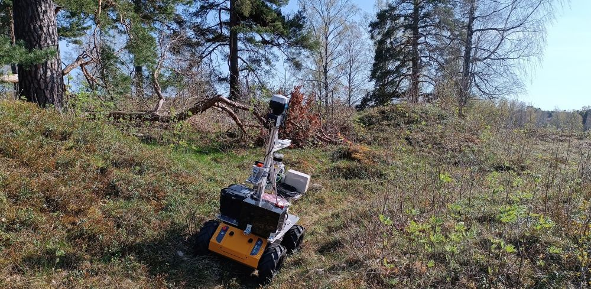
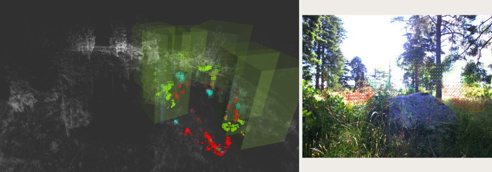
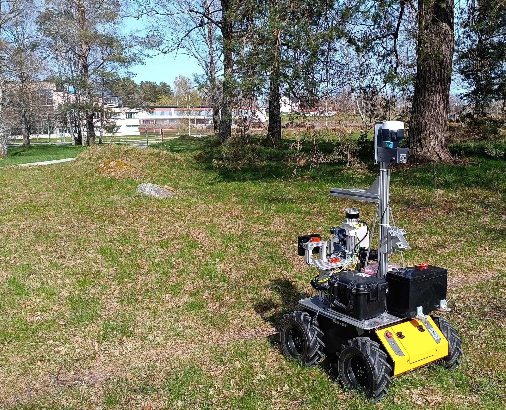
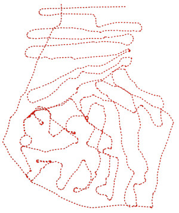
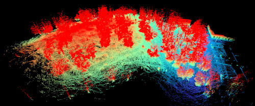
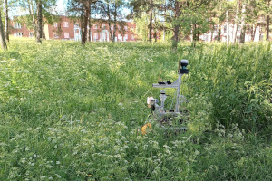
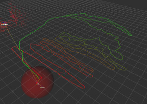
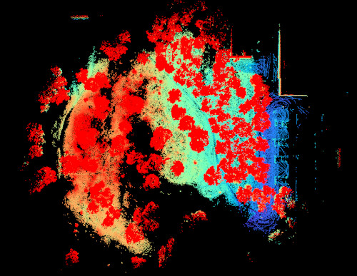

### 📚 Table of Contents

* [Dataset Description](#dataset-description)
* [Dataset Parts](#dataset-parts)
* [Data Structure and File Organization](#data-structure-and-file-organization)
* [Downloads](#downloads)
* [Examples and Teasers](#examples-and-teasers)
* [Acknowledgement](#acknowledgement)

# The Radar Forest Dataset [working title]

## Dataset description

*The recorded dataset captures a forested area that contains fully grown and young trees, dense undergrowth, bumpy terrain and occasional rocks.*

The dataset captures a forested area that contains both fully grown and young trees, dense undergrowth, bumpy terrain and occasional rocks.
Clearpath Husky robot was teleoperated through the area in May and June 2024, each time driving roughly one hour while recording its onboard sensors: LiDAR, high-resolution 4D radar, GNSS, RGB camera, IMU and internal odometry.
Thanks to the GNSS receiver and lidar data, reference lidar point cloud map and thus absolute positioning of the robot during the experiment are available.
Moreover, to support 4D radar research in detetection and classification of obstacles in similar environments, the dataset provides labels (3D cuboids) for several classes (e.g., tree trunk, tree canopy, bush, ...) and
ROS2 tools that use these cuboids to label arbitrary point clouds in the dataset (lidar, radar, accumulated versions of those, or sub-maps).


*Using the [Segments.ai](https://segments.ai) online 3D labeling solution, the reference point cloud maps from two recording runs were manually labelled.*


The data are provided as ROS bag files, both for ROS1 and ROS2, and the point-cloud-labeling tools are available for ROS2. 
Since the labelled point clouds are published as standard `PointCloud2` messages, it is possible to convert the labelled clouds back to ROS1 either by ROS bridge, or by converting bag files (e.g., by [Rosbags](https://pypi.org/project/rosbags/) library.)
A tool for point cloud accumulation is also provided. Based on the message count or distance travelled, denser point clouds are produced and optionally saved in `.pcd` format, allowing easy post-processing.


*Provided ROS tools annotate the radar or lidar pointclouds, display used cuboids in Rviz.*

---

## Dataset Components

### Data from the recording sessions

* **Short grass: May 2024** (4068s)
Area of approx. 200x200m was captured by the Husky mobile robot in a "search pattern" fashion, resulting in dense coverage by all the onboard sensors.
In the beginning of summer, the undergrowth is not yet fully developed, therefore the visibility conditions for the camera and lidar are good.
Besides the raw data from the robot, a reference map is provided as well as raw GNSS data from a static and mobile receiver.





* **Tall grass: June 2024** (3811s)
The same area was visited again one month later in June, when the undergrowth became in some sections even higher than the robot itself.
In these conditions, the comparison between camera, lidar and radar becomes interesting for the field robotics applications.





### ROS1 and ROS2 tools

* **ROS1 tools - helper launch files**
The ROS1 variant of the bag files is accompanied by a set of launch files allowing reprocessing of the Ouster lidar raw packets, adding additional TFs, and publishing the reference point cloud map for Rviz visualisation.
The tools are available in a separate repository: **TODO** 

* **ROS2 tools - point cloud labelling tools**
The provided ROS2 tools allow online labeling of point clouds, either lidar or radar, based on the provided set of cuboids stored in a yaml file (included).
For convenience, a tool for accumulating a series of pointclouds, republishing them and also saving as `.pcd` files is also provided.
Similarly to ROS1, a launch file for publishing a reference point cloud map and Rviz config file are also available.
The tools are available in a separate repository: **TODO** 
---

## Data Structure and File Organization

The dataset is split into two parts, ROS1 and ROS2, both of them containing basically the same data.
The main difference is that ROS1 contains raw packets of the Ouster lidar, and the user is expected to run provided launch file to 
reconstruct all the topics the sensor provides. This saves space and speeds up the dataset download.
Since it has shown to be problematic to run ROS2 Ouster driver with packets recorded in ROS1, the topics deemed most useful has been saved in the ROS2 bag files, instead of the raw packets.
For convenience, de-skewed lidar point cloud has been saved in both versions.

Regarding the file organization, see the tree below:

```
├── ros1_noetic
│   ├── calibration                                   
│   │   ├── extrinsics
│   │   │   ├── extrinsics.txt                        # Transforms between sensor frames, also available in /tf
│   │   │   └── frames.pdf                            # Output of rqt TF visualization
│   │   └── intrinsics
│   │       ├── camera_calibration.txt                # Output of the OpenCV camera calibration
│   │       └── hugin_radar_startup_params.txt        # The Hugin radar startup sequence, affects sensitivity and amount of points
│   └── data
│       ├── 2024_05_short_grass_run                   # The short grass run 
│       │   ├── bags                                  # ROS1 bag files, play with "rosbag play --clock short_grass__ros1__*"
│       │   │   ├── short_grass__ros1__00.bag        
│       │   │   ├── ...
│       │   │   └── short_grass__ros1__45.bag
│       │   ├── gps                                   # Post-processed RTK solution and raw data. See Emlid documentation to recompute yourself
│       │   │   ├── filtered_RTK_solution.pos         # Filtered == Only sections with approx >15 sattelites kept
│       │   │   ├── full_RTK_solution.pos             # Original RTK solution, but in a forest, so sometimes quite bad
│       │   │   ├── ReachBaseSt_20240501125754
│       │   │   ├── ReachRoverO_20240501133817
│       │   │   └── readme.txt
│       │   └── reference_point_cloud_map             # Reference point cloud map, created by using Norlab ICP mapper and HDL graph slam
│       │       ├── short_grass_map.pcd
│       │       ├── short_grass_map_subsampled.pcd
│       │       └── short_grass_map_with_normals.vtk
│       └── 2024_06_tall_grass_run                    # Tall grass run, same structure as in Short grass 
│           ├── bags
│           │   ├── tall_grass__ros1__00.bag
│           │   ├── ...
│           │   └── tall_grass__ros1__44.bag
│           ├── gps
│           │   ├── filered_RTK_solution.pos
│           │   ├── full_RTK_solution.pos
│           │   ├── ReachBaseSt_20240612080138
│           │   ├── ReachRoverO_20240612080516
│           │   └── readme.txt
│           └── reference_point_cloud_map
│               ├── readme.txt
│               ├── tall_grass_map.pcd
│               ├── tall_grass_map_subsampled.pcd
│               └── tall_grass_map_with_normals.vtk
└── ros2_jazzy
    ├── calibration                                                # Same contents as in ROS1
    ├── cuboid_labels                                              # Cuboid labels from Segments.ai labelling service.
    │   └── short_and_tall_grass_labels.json
    └── data                                                       
        ├── 2024_05_short_grass_run
        │   ├── bag                                                # ROS2 bagfiles
        │   │   └── short_grass__ros2
        │   │       ├── metadata.yaml
        │   │       ├── short_grass__ros2_0.mcap
        │   │       ├── ...
        │   │       └── short_grass__ros2_48.mcap
        │   ├── gps                                                # Same contents as in ROS1
        │   └── reference_point_cloud_map                          # Same contents as in ROS1
        └── 2024_06_tall_grass_run
            ├── bag
            │   └── tall_grass__ros2
            │       ├── metadata.yaml
            │       ├── tall_grass__ros2_0.mcap
            │       ├── ...
            │       └── tall_grass__ros2_49.mcap
            ├── gps                                                # Same contents as in ROS1
            └── reference_point_cloud_map                          # Same contents as in ROS1
```


### Sensors and topics
The dataset sensor measurements from these sensors:

* Sensrad Hugin A3-Sample (solid-state 4D radar)
  * **Please note** that the Hugin A3-Sample radar used in our dataset is an early demo model not with the same performance as the forthcoming production-ready model.
  * Topic: `/hugin_raf_1/radar_data`
* Ouster OS0-32 (3D lidar)
  * This sensor is available for tuning and verification of your SLAM solution, but not available in the competition runs (i.e., the topic with point clouds will not be published in the Docker environment).
  * Topics in ROS1: `/ouster/lidar_packets`, `/ouster/imu_packets`, `/point_cloud_deskewed` - for convenience, already motion-corrected point cloud
  * Topics in ROS2: `/ouster/imu`, `/ouster/points`, `/ouster/range_image`, `/point_cloud_deskewed`
* IDS Imaging uEye camera (2056x1542px)
  * Calibrated with checkerboard OpenCV camera calibration
  * Topics: `/ids_camera/image_raw/camera_info`, `/ids_camera/image_raw/compressed`
* Xsens MTi-30 (IMU)
  * Topics: `/imu/data`, `/imu/mag`, `/imu/time_ref` 
* Emlid Reach RS2+ (RTK-GNSS receiver pair)
  * Topics from the receiver (single receiver mode): `/emlid_gnss/fix`, `/emlid_gnss/nmea_sentence`, `/emlid_gnss/time_reference`, `/emlid_gnss/vel`
  * Topics with post-processed RTK solution: `/rtklib/post_fix` (complete solution, various quality - SINGLE, FLOAT, FIXED), `/rtklib/post_fix_q1` (only the best quality, FIXED)
* Husky odometry fused with the Xsens MTi-30 IMU
  * Topic: `/husky_udp_bridge/cmd_vel` (teleoperation commands), `/husky_udp_bridge/odom` (pure odom), `/imu_odom` (fused imu-odometry)
* Reference localization w.r.t. the provided reference point cloud maps
  * Topic: `/icp_odom` (expresses the pose of the /base_link in /map)

### Reference Contents

**GNSS**

The GNSS reference was recorded with a pair of Emlid Reach RS2+ receivers, one serving as a mobile station attached to the robot, the second served as a reference static station.
The RTK solution was obtained using RTKLIB, and the output was added back to the ROS bag files, synchronized with the saved NMEA messages (for each NMEA message carriying time and position, equivalent `/rtklib/post_fix` or `/rtklib/post_fix_q1` was added).
Note that the system clock of the robot was not precisely synchronized with the GPS clock, therefore the ROS time stamps of the `/rtklib/post_fix` messages are to be considered w.r.t. to the rest of the recorder sensor messages.

**Reference point cloud map**

The pose of the robot saved in the ROS bag files is based on SLAM result of using Norlab's [ICP Mapper](https://github.com/norlab-ulaval/norlab_icp_mapper_ros) as a front-end for the [HDL Graph Slam](https://github.com/koide3/hdl_graph_slam) graph optimization.
The high-quality `/rtklib/post_fix_q1` fix messages were used as constrains, and the whole map frame is aligned with the Universal Transverse Mercator (UTM) frame. Unfortunatelly, the GNSS coverage under tree canopy is a hard problem, therefore the number of 
precise GNSS measurements is limited. Each run has it's own map, and when inspected the alignment after registration of these to maps to each other, we estimate the position uncertainty to +-30cm (large-scale deformations, locally consitent).
This accuracy is adequate to the intended purpose of the dataset, which is point cloud segmentation training/testing.

To use different reference, the bag files need to be filtered, removing the `/icp_odom` topic and the `/map->/odom` TF messages. Similarly, to test different odometry solutions, remove `/odom->/base_link` TF messages as well.

---

## Downloads

* [TODO](https://www.todo.com) (XX GB in total)

---

## Examples and Teasers


*Recorded in June, the grass was tall enough to often obscure the robot sensors.*


*The robot was intentionally driven through bushes and over uneven terrain.*

### Video Teasers

Removed for double-blind review

## Acknowledgement

The camera stream in this dataset was anonymized using [EgoBlur](https://github.com/facebookresearch/EgoBlur), and [deface](https://github.com/ORB-HD/deface) automated tools.
* Raina, N., Somasundaram, G., Zheng, K., Miglani, S., Saarinen, S., Meissner, J., Schwesinger, M., Pesqueira, L., Prasad, I., Miller, E., Gupta, P., Yan, M., Newcombe, R., Ren, C., & Parkhi, O. M. (2023). EgoBlur: Responsible Innovation in Aria. arXiv preprint [arXiv:2308.13093](https://arxiv.org/abs/2308.13093).
* Optimization in Robotics and Biomechanics, Deface, (accessed 2025), GitHub repository, [https://github.com/ORB-HD/deface](https://github.com/ORB-HD/deface)

The dataset was labelled using the online tools from [Segments.ai](https://segments.ai) who generously provided us a free academic license.
* Segments.ai (2023). Segments.ai data labeling platform, [https://segments.ai](https://segments.ai).

The reference map and localization was constructed using Norlab's [ICP Mapper](https://github.com/norlab-ulaval/norlab_icp_mapper_ros) serving as a lidar odometry frontend for the [HDL Graph Slam](https://github.com/koide3/hdl_graph_slam)
* Pomerleau, F., Colas, F., Siegwart, R., & Magnenat, S. (2013). Comparing ICP Variants on Real-World Data Sets. Autonomous Robots, 34(3), 133–148. 
* Kenji Koide, Jun Miura, and Emanuele Menegatti, (2019). A Portable 3D LIDAR-based System for Long-term and Wide-area People Behavior Measurement, Advanced Robotic Systems, [link](https://www.researchgate.net/publication/331283709_A_Portable_3D_LIDAR-based_System_for_Long-term_and_Wide-area_People_Behavior_Measurement)


  


